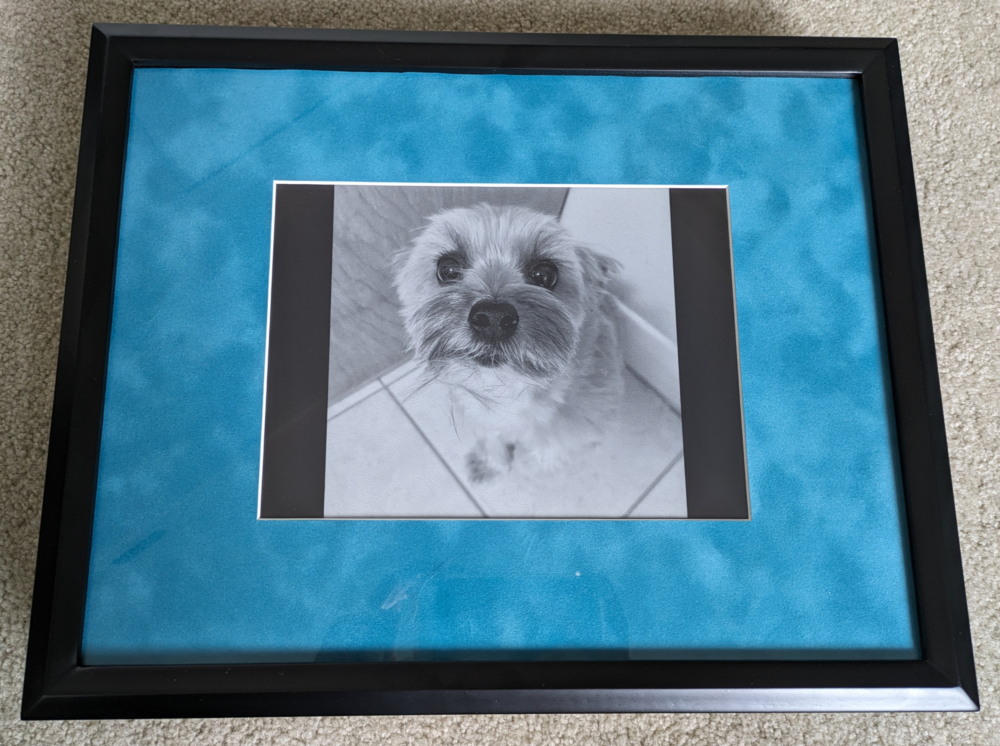

# Pi-Frame
I wanted a digital picture frame, but I couldn't find one that had all the features I was looking for. I decided to build one instead.

Although this repo does not aim to provide detailed step-by-step instructions, it *does* aim to provide an adequate enough summary to help out if you decide to build something similar.

If you're wondering if this is a good project for you to tackle, here's a little more information about my prior knowledge & skills before I began the project:

* Raspberry Pi hardware: Beginner
* e-ink displays: None
* General Linux use: Intermediate
* Bash scripting: Beginner
* Python scriptiong: Intermediate

## Project Goals
What I wanted -- and what I couldn't find in a reasonably-priced commercial product -- was:

* A digital picture frame with relatively large e-ink display
* Automatically sync pictures from a remote server
* Fully wireless, including battery power
* Maximum battery life
* No soldering

## How it works in practice
* I upload pictures to an always-on staging server. No pre-processing is necessary, but I find the display looks best when I manually convert the images to grayscale and tinker with the contrast first.
* The battery-powered Pi-Frame boots at a scheduled time (I use every 2 hours). It automatically checks for new images from the remote server, then displays a random image from local storage.
* If Pi-Frame is operating on battery power, it shuts down to a zero-power state until its next scheculed boot. If charging, it remains on (to allow convenient direct access via ssh) and updates to a new image every 5 minutes.
* One full update cycle (boot, check for new images, update the display, and power down) consumes roughly 1% of the battery's capacity, so it can run for approximately 100 updates on a full charge. Because I set the display to update every two hours, I expect to get about 8 days of operation out of a single charge.

## Equipment
* Brains: [Raspberry Pi Zero W](https://www.raspberrypi.com/products/raspberry-pi-zero-w/) with pre-soldered header ("WH" model)
* Display: [10.3-inch, 16-shade grayscale e-ink display with HAT interface from Waveshare](https://www.waveshare.com/product/10.3inch-e-paper-hat.htm)
* Battery: PiSugar 2 from [PiSugar](https://www.pisugar.com/), which includes an onboard clock for automatic booting on a schedule
* For framing:
    * A deep, shadowbox-style frame from the local arts & crafts store
    * A custom-cut photo mat to fit the frame & e-ink display, also from the local arts & crafts store
    * A small sheet of acrylic. I wanted to make a window in the back of the picture frame so I could see the status lights on the Pi and battery.
    * A 4.5-inch micro USB extension cable so that I could easily charge the battery without opening the frame
    * M 2.5 mounting screws and standoffs
    * A GPIO ribbon cable. This let me separate the Pi from the e-ink display's controller board, as otherwise, the stack would have been really tall and finding a thick enough frame would have been a challenge.

## Build

### Set up the Pi
The Raspberry Pi folks already have a [very nice setup guide](https://www.raspberrypi.com/documentation/computers/getting-started.html). Key features that I enabled when preparing the Pi's SD card were:

* Configuring wifi
* Enabling ssh access for headless operation

### Connect & configure the display.

Connect the display & install drivers using the [manufacturer's guide.](https://www.waveshare.com/wiki/10.3inch_e-Paper_HAT) Briefly, I:

* Physically connected the e-ink driver board via the HAT.
* Confirmed the driver board is physically switched to SPI mode.
* Installed the [BCM2835 library](https://www.airspayce.com/mikem/bcm2835/).
* Enabled the SPI interface via `raspi-config`.
* Installed the Waveshare library via the latest release from Github.
* Tested the display via the binary compiled above.

### Install the battery

[Physically installing](https://github.com/PiSugar/PiSugar/wiki/PiSugar2#hardware-installation) the PiSugar 2 battery was a simple enough. The manufacturer also provides [a very handy API](https://github.com/PiSugar/pisugar-power-manager-rs) that allows you to poll key battery vitals (like charge percentage and whether or not it is actively charging). The API also allows you to schedule a boot time, which will become critical in the *Automate everything* section.

### Prepare a Python interface for the display
#### Install the [RPi.GPIO library](https://sourceforge.net/projects/raspberry-gpio-python/).
The official [wiki](https://sourceforge.net/p/raspberry-gpio-python/wiki/install/) recommends installation via the official Raspberry Pi repositories: `sudo apt install python3-rpi.gpio`. However, in my hands, this provided a library two years out-of-date vs. the [PyPI version](https://pypi.org/project/RPi.GPIO/). The older version installed from the Pi repository did not support the hardware in a way I still don't quite undertand. (When I tried to use the package from the Pi repository, in downstream steps, I was ultimately stuck with an error while importing RPi.GPIO with a traceback to it's Jetson.GPIO dependency: `Exception: Could not determine Jetson model.`)

I found it *critical* to forego the older version of `RPi.GPIO` from the repository and instead install the latest version via `sudo pip install RPi.GPIO`. Note that although installation of `pip` packages using `sudo` typically isn't recommended, I found that it was the only way to get the display working.

#### Install the Python controller for the e-ink display
There is a [Python library](https://github.com/GregDMeyer/IT8951) for the IT8951 e-ink controller, which serves as the interface between the Raspberry Pi and the display itself. By cloning the project repository, you'll also get access to a handful of tests. As of this writing, `test/integration/test.py` provides a convenient way to make sure the display is updatable via Python.

#### Install [Omni-EPD](https://github.com/robweber/omni-epd).
Although the IT8951 controller library above provices all the necessary tools for printing an image to the display, I found that that Omni-EPD offers a more convenient wrapper.

### Scripting to update the display
I wrote a Python script, `show_image.py` to fully manage updating the display with a single command. Called with `python show_image.py /path/to/image`, the script automates interaction with Omni-EPD. It also accepts an optional argument, `--message "some message to display`, which overlays a small banner at the top of the image. In the next section ("Automate everything"), I use the message function to display a warning when the battery is low and needs to be recharged.

Another Python script, `prepare_image.py` is called as a subroutine by `show_image.py`. It uses the `PIL` library to handle the heavy lifting for image processing: scaling it to fit on the display without distortion, and overlaying the optional message described above.

### Automate everything
The bash script, `update_piframe.sh` provides a single point for automatic operation of all of Pi-Frame's key operations. It:

* Uses `rsync` to fetch new images or *update any of the scripts, including itself* from a remote server. By using an always-on, remote server for staging the updates, the Pi-Frame itself can be powered down most of the time to conserve its battery. I'm using another Raspberry Pi as my remote staging server, but you could use anything.
* Also uses `rsync` to send logs to the remote staging server so that troubleshooting is easier, even when Pi-Frame is powered down.
* Polls the battery's charge state & displays a warning message on the e-ink screen if the charge is low.
* Selects a random image and calls `show_image.py` to display it.
* Schedules the next boot after a user-defined delay. I use a 2-hour delay to help preserve the battery.
* Finally, shut down the Pi so the battery isn't drained (but only if operating on battery power). It remains powered on while charging in case I want to connect to it via ssh.

I've used a `systemd` service and timer (`pi-frame_update.service` and `pi-frame_update.timer`] to automatically execute `update_piframe.sh` on boot. As mentioned above, the logs are written to a plain-text file and synced remotely to facilitate troubleshooting rather than relying on `journalctl`.

**Note:** In all of the scripts mentioned above & in the systemd timer, I've replaced file paths that I used with dummy paths, such as `/absolute/path/to/local/images/`. If you use any of these scripts, make sure you update the paths for your system.

## Final assembly
As mentioned in the *Equipment* section, I used a deep, shadowbox-style frame (11-inches x 14-inches) that I bought off-the-shelf at my local arts & crafts store. I had them custom-cut a mat to fit the frame and the e-ink display. The display is mounted to the mat using electrical tape.

I wanted to be able to see the status LEDs on the Pi during normal operation, so I cut a window into the back of the frame. Using nylon standoffs and screws, I mounted the Pi, battery, and display controller board to a leftover piece of acrylic I had from another project. I also drilled a hole into the acrylic so I could run a short micro USB extension cable through it; that allows me to easily charge the battery without opening the frame.

After connecting everything and gluing the acrylic sheet into the cutout at the back of the frame, the project is all done! There are a few pictures of the finished product in the `project-photos` directory.
